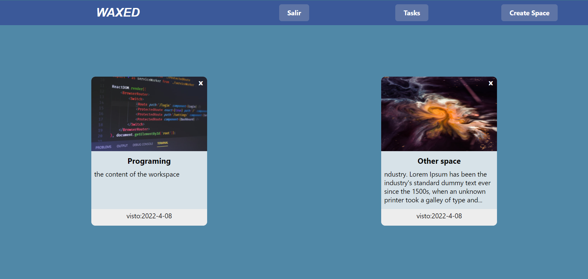
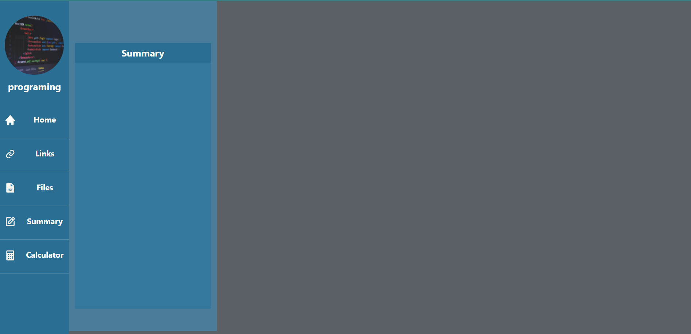
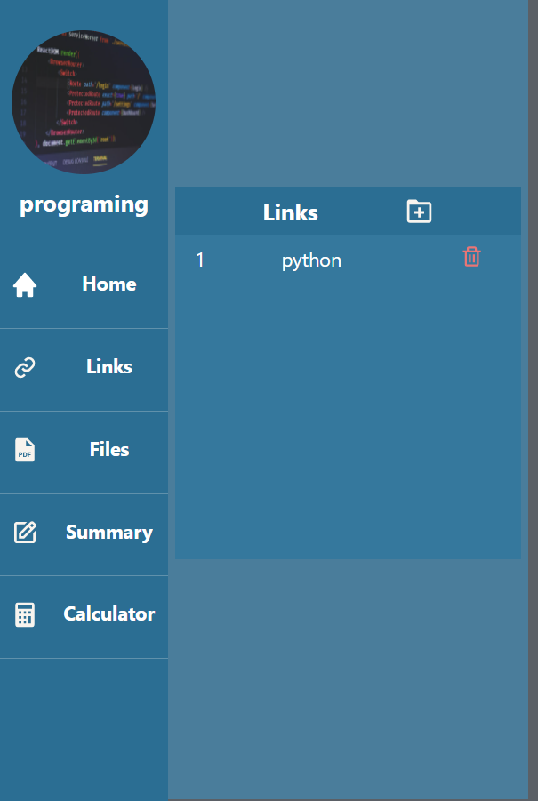
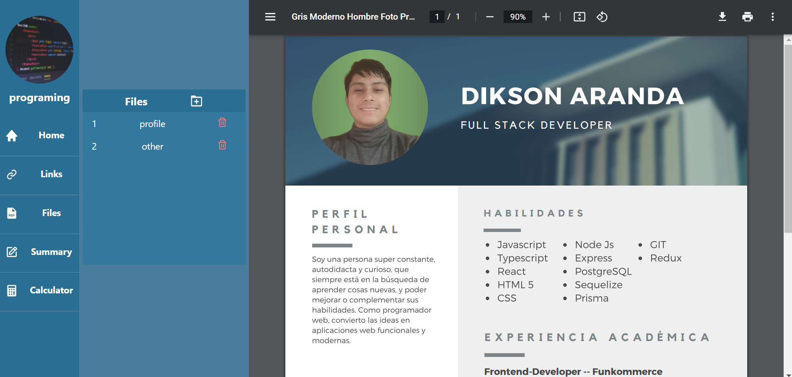
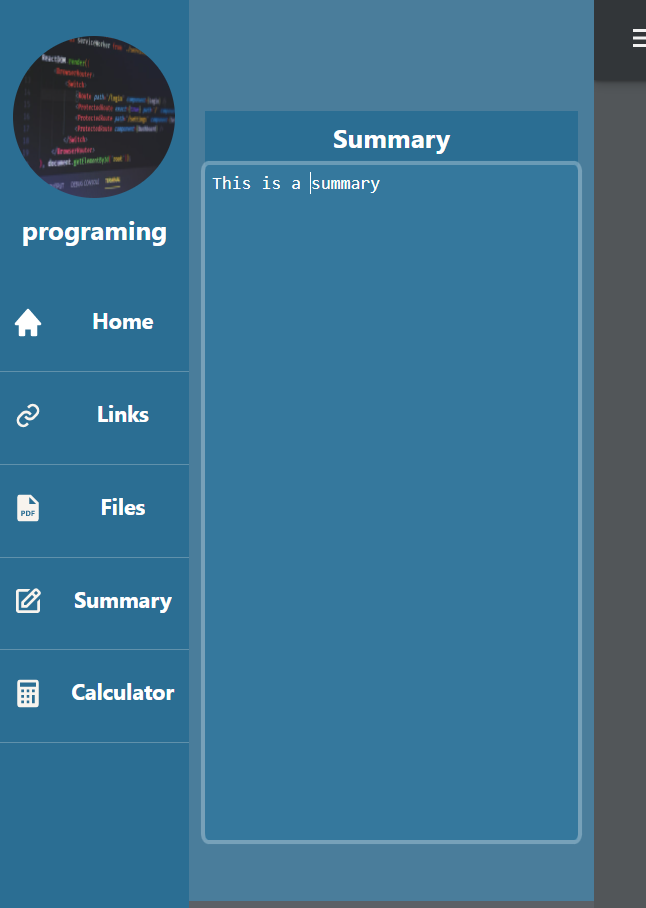
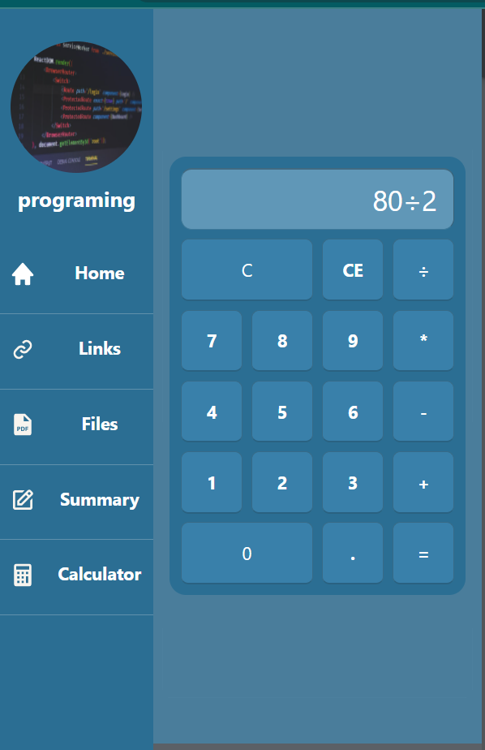
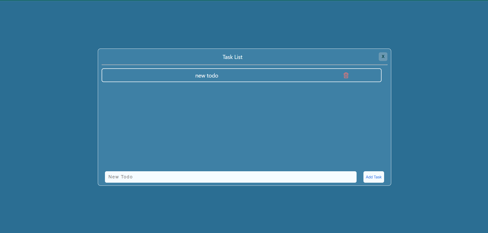

# Waxed

This project was created to improve my skills in web application development.

Is an application to have a better organization of information.With this app you can do:

### Create learning spaces:

Each learning space is a work environment to keep the files and links organized.

### Control Panel:

### Create and delete links and PDF files:

We can create and delete the links that we want to save, with a name for each link, and in the same way with the files. We can also view the pdf's content.

<!--
-->

### Add a summary or a note:

We can add a comment or summary of something we are doing or we just want to save some text.

### Use the calculator:

It is a basic calculator that allows you to perform simple calculations

### Add, cross out, or delete a todo:

We can create a todo, mark them as completed and delete it.

<b>
If you want to see a video about this project I invite you to see it on my
<a href='https://www.linkedin.com/feed/update/urn:li:activity:6916778786877235200' target='_blank'>
  linkedin🧨
</a>
  </b>

